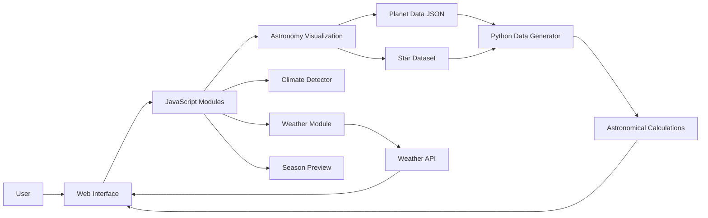
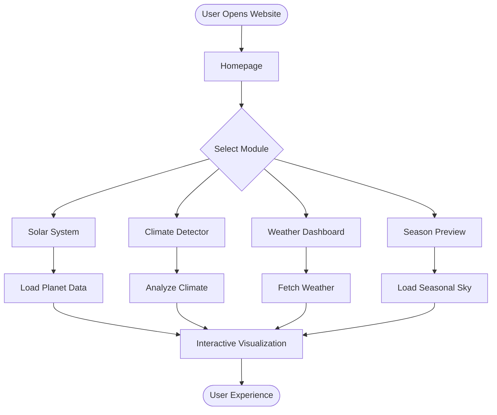

<div align="center">

# 🌞 Kodaikanal Solar Observatory
### Interactive Astronomy & Climate Visualization Platform

<p align="center">
An interactive web platform that visualizes astronomical objects, weather insights, and seasonal sky changes for the Kodaikanal Solar Observatory using Python, JavaScript, HTML, and CSS.
</p>

<p align="center">


</p>

---

## 📖 Project Overview

The **Kodaikanal Solar Observatory** project is an interactive astronomy visualization platform that combines **planetary simulations, real-time weather information, climate analysis, and seasonal sky visualization** into a single user-friendly interface.

The platform helps users understand celestial movements while providing climate-related insights for Kodaikanal through dynamic visualizations and astronomical datasets.

---

# ✨ Features

✅ Interactive Solar System Visualization

✅ Earth-Centered Planet Simulation

✅ Seasonal Sky Preview

✅ Weather Information

✅ Climate Detector

✅ Planet & Star Dataset Generation

✅ Astronomy Data Visualization

✅ Responsive User Interface

---

# 🏗️ System Architecture



---

# 🔄 Project Workflow



---

# 📂 Folder Structure

```
Kodaikanal-Solar-Observatory
│
├── assets/
│   ├── earth.png
│   ├── mars.png
│   └── saturn.png
│
├── animation.js
├── astronomy_live.js
├── climate-detector.js
├── Weather fetcher.js
├── generate_kodaikanal_planets_stars.py
├── kodaikanal_scraper_python.py
├── kodaikanal_planets_stars.json
├── kodaikanal_astronomy_data.json
├── solar_system_earth_centered.html
├── season-preview.html
├── index.html
├── style.css
└── README.md
```

---

# ⚙️ Technologies Used

| Technology | Purpose |
|------------|----------|
| HTML5 | Web Structure |
| CSS3 | Styling |
| JavaScript | Frontend Logic |
| Python | Astronomy Calculations |
| JSON | Planet & Star Data |
| Weather API | Weather Information |

---

# 🚀 Application Flow

```text
User
 │
 ▼
Homepage
 │
 ▼
Choose Module
 │
 ├──────────────┐
 ▼              ▼
Weather     Astronomy
 │              │
 ▼              ▼
API        JSON Dataset
 │              │
 └──────┬───────┘
        ▼
 Visualization
        │
        ▼
 Interactive Dashboard
```

---

# 🌍 Modules

### 🌞 Solar System

Interactive visualization of planets relative to Earth.

---

### 🌦️ Weather Dashboard

Displays live weather conditions.

---

### 🌡️ Climate Detector

Analyzes local climate conditions.

---

### 🌌 Season Preview

Shows the seasonal night sky.

---

### ⭐ Astronomy Dataset

Generated using Python scripts and JSON datasets.

---

# 📈 Future Enhancements

- 🌍 Real-time NASA APIs
- ☁️ Cloud Deployment
- 📱 Mobile Responsive Version
- 🤖 AI-based Celestial Predictions
- 🛰️ Satellite Tracking
- 🌠 Meteor Shower Notifications

---

# 👨‍💻 Developed By

## Jawagar K R

B.Tech Computer Science and Business Systems

VIT-AP University

GitHub: https://github.com/YOUR_USERNAME

LinkedIn: https://linkedin.com/in/YOUR_PROFILE

---

# ⭐ If you like this project

Give this repository a ⭐ Star and support the project!
